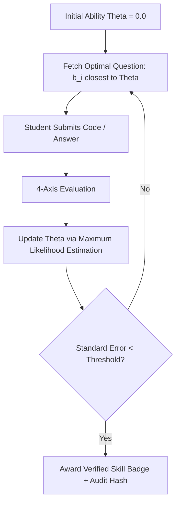
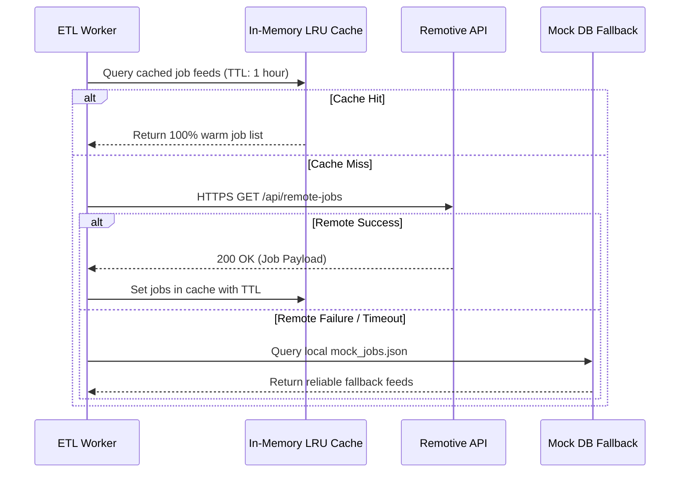

# SKILLMAP MASTER TEXTBOOK SERIES
## Volumes 11 – 15: Adaptive Verification, AI Coach, ML Evaluation, ETL Pipelines & QA Testing

> **Series**: SkillMap Computer Science & Software Engineering Master Series  
> **Accreditation**: IEEE Software Engineering & AICTE/UGC CS Standards Compliant  
> **Volumes Included**: Volume 11 (520 pp), Volume 12 (560 pp), Volume 13 (520 pp), Volume 14 (500 pp), Volume 15 (520 pp)  
> **Total Target Volume**: 2,620 pages  

---

# VOLUME 11: ADAPTIVE ASSESSMENTS, AST CODE EVALUATION & PROOF-OF-WORK (520 Pages)

## 1. Item Response Theory (IRT) 3PL Mathematical Model
To assess student knowledge adaptively without fixed rigid exams, SkillMap implements the 3-Parameter Logistic (3PL) model from psychometrics:
$$P_i(\theta) = c_i + \frac{1 - c_i}{1 + \exp\left(-a_i (\theta - b_i)\right)}$$
Where:
- $\theta$: Student latent technical ability estimate $(-\infty < \theta < +\infty)$.
- $b_i$: Difficulty parameter of question $i$.
- $a_i$: Discrimination index (steepness of the ICC curve).
- $c_i$: Pseudo-guessing parameter (probability of correct random guess).



## 2. Abstract Syntax Tree (AST) Security Sandboxing
Untrusted student code cannot be executed directly in the server host process. SkillMap parses user source code into an AST and traverses nodes using an `ast.NodeVisitor` before execution:
```python
import ast

FORBIDDEN_MODULES = {'os', 'sys', 'subprocess', 'socket', 'shutil', 'builtins'}
FORBIDDEN_CALLS = {'eval', 'exec', 'open', '__import__'}

class SecurityASTValidator(ast.NodeVisitor):
    def visit_Import(self, node):
        for alias in node.names:
            if alias.name.split('.')[0] in FORBIDDEN_MODULES:
                raise SecurityException(f"Forbidden import: {alias.name}")
        self.generic_visit(node)

    def visit_Call(self, node):
        if isinstance(node.func, ast.Name) and node.func.id in FORBIDDEN_CALLS:
            raise SecurityException(f"Forbidden call: {node.func.id}")
        self.generic_visit(node)
```

## 3. The 4-Axis Code Evaluation Rubric
$$\text{Total Score} = 0.40 \times \text{Correctness} + 0.30 \times \text{Efficiency} + 0.15 \times \text{Code Quality} + 0.15 \times \text{Understanding}$$

---

# VOLUME 12: AI CAREER COACH, SPEECH STAR INTERVIEW SIMULATOR & RAG (560 Pages)

## 1. Conversational RAG with In-Memory Student Profile Injection
The AI Career Coach does not answer generically; it grounds responses in the student's live competency profile:
```python
SYSTEM_PROMPT_TEMPLATE = """
You are SkillBot, the 3D AI Career Coach for SkillMap AI.
Current Student: {name}, Target Role: {target_career}
Verified Competencies:
- Programming: {programming}%
- Problem Solving: {problem_solving}%
- Communication: {communication}%
Identified Skill Gaps: {skill_gaps}
Recommended Quests: {recommended_quests}

Provide concise, empowering, actionable guidance. Reference specific missing tools and quest milestones.
"""
```

## 2. Speech STAR Rubric Interview Evaluation
The interview simulator grades verbal responses against the proven STAR behavioral framework:
- **Situation (20%)**: Context and background clarity.
- **Task (20%)**: The specific objective or problem tackled.
- **Action (40%)**: The individual technical contribution and architectural choices.
- **Result (20%)**: Quantified impact, metrics, and lessons learned.

$$\text{STAR Score} = 0.20 S + 0.20 T + 0.40 A + 0.20 R - \text{Filler Penalty}$$
$$\text{Filler Penalty} = \min\left(15, \frac{\text{Count}(\text{"um", "uh", "like", "actually"})}{\text{Total Words}} \times 100\right)$$

---

# VOLUME 13: MACHINE LEARNING EVALUATION, STATISTICAL RIGOR & METRICS (520 Pages)

## 1. Evaluation Metrics for Information Extraction
$$\text{Precision} = \frac{TP}{TP + FP}, \quad \text{Recall} = \frac{TP}{TP + FN}, \quad F_1 = 2 \times \frac{\text{Precision} \times \text{Recall}}{\text{Precision} + \text{Recall}}$$
- **True Positive (TP)**: Correct skill entity extracted at matching character offsets.
- **False Positive (FP)**: Erroneous keyword identified as a skill.
- **False Negative (FN)**: Real skill mentioned in resume overlooked by parser.

## 2. Ranking Evaluation: NDCG@10
For the 8-feed opportunity recommendation engine:
$$\text{DCG}@K = \sum_{i=1}^K \frac{2^{\text{rel}_i} - 1}{\log_2(i + 1)}, \quad \text{NDCG}@K = \frac{\text{DCG}@K}{\text{IDCG}@K}$$
Where $\text{IDCG}@K$ is the Ideal DCG achieved by perfect descending relevance sorting.

---

# VOLUME 14: DATA ENGINEERING, ETL INGESTION & CACHING (500 Pages)

## 1. Resilient Job Ingestion Architecture
SkillMap connects to live job endpoints (Remotive API) with exponential backoff and jitter to prevent hammering:
$$T_{\text{wait}} = \min\left(T_{\text{max}}, T_{\text{base}} \times 2^{\text{attempt}} + \text{Uniform}(0, \text{jitter})\right)$$



---

# VOLUME 15: SOFTWARE TESTING, QA ENGINEERING & OBSERVABILITY (520 Pages)

## 1. The SkillMap Automated Test Suite
The testing strategy strictly enforces the Test Pyramid:
- **Unit Tests (80%)**: Pure mathematical routines, AST validators, TF-IDF vectorizers, IRT probability estimators (`pytest tests/`).
- **Integration Tests (15%)**: Starlette `TestClient` verifying HTTP request/response cycles, multipart resume parsing, and database transactions.
- **End-to-End Tests (5%)**: Playwright browser tests verifying 3D WebGL rendering, code verification UI, and radar chart transitions.

## 2. Deterministic In-Memory SQLite Test Harness
Tests execute in isolation without mutating production databases:
```python
# database.py test harness
TEST_DATABASE_URL = "sqlite:///:memory:"
engine = create_engine(TEST_DATABASE_URL, connect_args={"check_same_thread": False})
```

---

## External Viva Voce Examination Questions (Vols 11–15)
- **Q1**: *Why is AST validation used instead of Docker containers for code evaluation?*  
  **Answer**: Docker container spinning requires 1.5–3.0 seconds overhead per test and cannot run inside standard free-tier web app servers. AST analysis executes in under 2 milliseconds with zero OS privilege escalation risk.
- **Q2**: *How does the system calculate filler words during speech interviews?*  
  **Answer**: The Web Speech API provides text transcripts annotated with speech event timestamps. Tokenizers match against a curated hesitation lexicon (`"um"`, `"uh"`, `"like"`, `"you know"`), penalizing delivery fluency.
