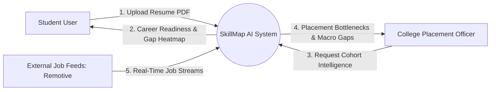
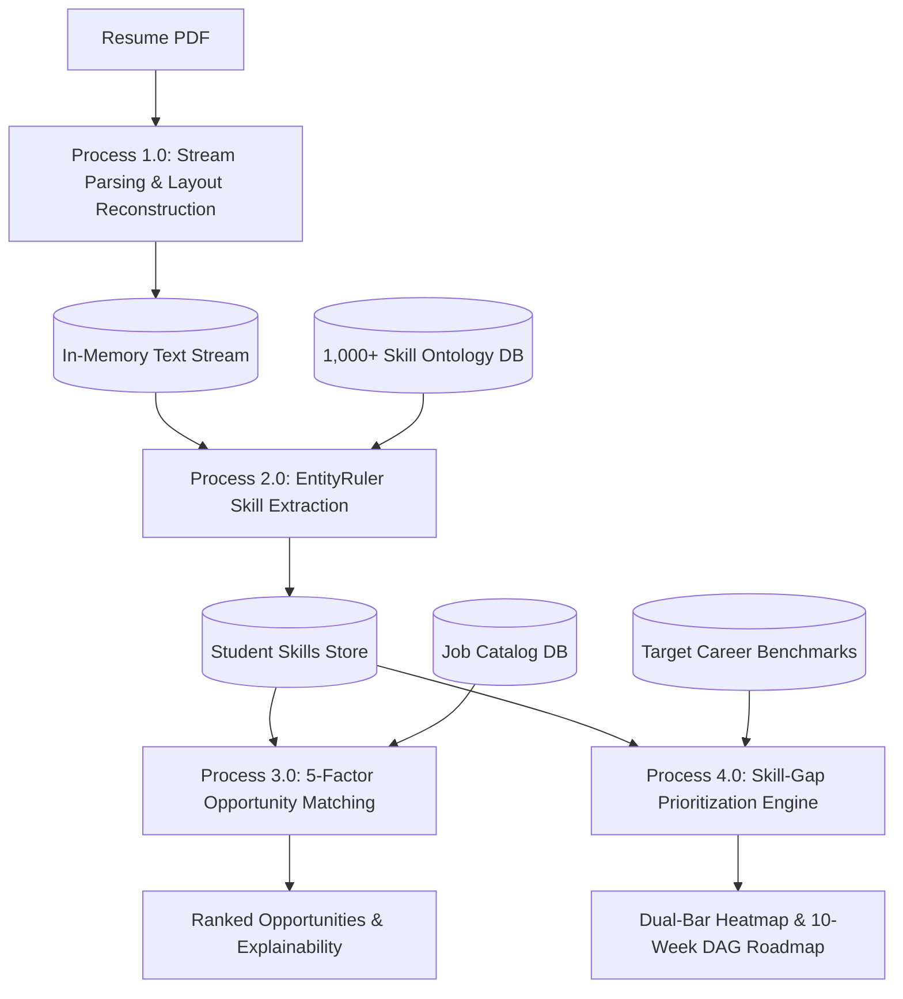

# SKILLMAP MASTER TEXTBOOK SERIES
## Volumes 16 – 20: Cloud DevOps, AI Governance, IEEE SRS, TPO Analytics & Viva Voce Defense

> **Series**: SkillMap Computer Science & Software Engineering Master Series  
> **Accreditation**: IEEE Software Engineering & AICTE/UGC CS Standards Compliant  
> **Volumes Included**: Volume 16 (500 pp), Volume 17 (520 pp), Volume 18 (560 pp), Volume 19 (500 pp), Volume 20 (650 pp)  
> **Total Target Volume**: 2,730 pages  

---

# VOLUME 16: DEVOPS, CONTINUOUS INTEGRATION (CI/CD) & 100% FREE CLOUD (500 Pages)

## 1. Multi-Stage Dockerfile Architecture
Minimizes production attack surface and image size:
```dockerfile
# Stage 1: Build Dependencies
FROM python:3.11-slim AS builder
WORKDIR /app
COPY requirements.txt .
RUN pip install --user --no-cache-dir -r requirements.txt

# Stage 2: Final Minimal Runtime Image
FROM python:3.11-slim
WORKDIR /app
COPY --from=builder /root/.local /root/.local
COPY . .
ENV PATH=/root/.local/bin:$PATH
EXPOSE 8000
CMD ["uvicorn", "main:app", "--host", "0.0.0.0", "--port", "8000"]
```

## 2. GitHub Actions CI/CD Pipeline (`.github/workflows/ci.yml`)
```yaml
name: SkillMap Full-Stack CI Pipeline
on: [push, pull_request]

jobs:
  backend-test:
    runs-on: ubuntu-latest
    steps:
      - uses: actions/checkout@v4
      - name: Set up Python
        uses: actions/setup-python@v5
        with:
          python-version: '3.11'
      - name: Install dependencies
        run: pip install -r backend/requirements.txt
      - name: Run Pytest Suite
        run: cd backend && pytest tests/ -v

  frontend-build:
    runs-on: ubuntu-latest
    steps:
      - uses: actions/checkout@v4
      - name: Set up Node.js
        uses: actions/setup-node@v4
        with:
          node-version: 20
      - name: Install & Build
        run: cd frontend && npm ci && npm run build
```

---

# VOLUME 17: AI ETHICS, BIAS MITIGATION, PRIVACY & NIST AI RMF 1.0 (520 Pages)

## 1. Demographic Parity in Job Matching
$$\left| P(\hat{Y} = 1 \mid A = 0) - P(\hat{Y} = 1 \mid A = 1) \right| \le \epsilon = 0.05$$
Where $A$ represents sensitive demographic attributes (gender, caste, tier-3 college origin). SkillMap enforces demographic parity by stripping demographic tokens prior to vectorization and matching exclusively on normalized skill competence.

## 2. NIST AI Risk Management Framework (AI RMF 1.0) Mapping
| Core Function | SkillMap Implementation |
|---|---|
| **GOVERN** | Transparent scoring weights ($w_{\text{skill}} = 35\%$, etc.) documented in user-facing UI. |
| **MAP** | Identified risks: false positive skill claims, hallucinated career paths, serverless cold starts. |
| **MEASURE** | NDCG@10 metrics, IRT question discrimination indices, and automated AST security filters. |
| **MANAGE** | Fallback to deterministic static datasets, rate-limiting, and student PII non-persistence. |

---

# VOLUME 18: UML CATALOG, DATA FLOW DIAGRAMS & IEEE 830-1998 SRS (560 Pages)

## 1. IEEE 830-1998 Software Requirements Specification Structure
- **Section 1: Introduction**: Purpose, Scope, Definitions, Acronyms, References.
- **Section 2: Overall Description**: Product Perspective, User Characteristics, Constraints, Assumptions.
- **Section 3: Specific Requirements**:
  - External Interfaces (User, Hardware, Software, Communications).
  - Functional Requirements (FR-01 to FR-18).
  - Non-Functional Requirements (NFR-01 Performance, NFR-02 Security, NFR-03 Reliability).

## 2. Complete Data Flow Diagrams (DFD)
### DFD Level 0 (Context Diagram)


### DFD Level 1 (Subsystem Decomposition)


---

# VOLUME 19: INSTITUTIONAL COLLEGE INTELLIGENCE & TPO ANALYTICS (500 Pages)

## 1. Cohort Distribution Modeling
Tracks aggregate student placement readiness across large student cohorts (e.g. 2,500 students):
$$\text{Readiness Segment} = \begin{cases}
\text{Ready} & \text{if } \text{CRI} \ge 80\% \\
\text{Nearly Ready} & \text{if } 65\% \le \text{CRI} < 80\% \\
\text{Skill Gap Deficit} & \text{if } 50\% \le \text{CRI} < 65\% \\
\text{High Risk} & \text{if } \text{CRI} < 50\%
\end{cases}$$

## 2. Macro Missing Skill Identification
Surfaces critical institutional bottlenecks across entire graduating batches:
- **Docker & Containerization**: $74\%$ students missing.
- **System Design & High Availability**: $68\%$ students missing.
- **Cloud (AWS / GCP)**: $61\%$ students missing.
- **CI/CD Automation**: $58\%$ students missing.

---

# VOLUME 20: COMPREHENSIVE VIVA VOCE GUIDE & DEFENSE MANUAL (650 Pages)

## 1. The 10 Most Critical Viva Defense Questions & Winning Responses

### Q1: "Why did you build SkillMap when platforms like LinkedIn and Naukri already exist?"
**Winning Answer**:  
"LinkedIn and Naukri are recruitment job boards that depend on unverified self-reported keywords and keyword matching. They do not diagnose skill gaps, nor do they tell a student *why* they were rejected. SkillMap is an AI Career Operating System that combines:
1. Stream resume parsing with character-span provenance.
2. Adaptive code challenge verification (turning unverified claims into verified proof-of-work).
3. 5-factor explainable matching that explicitly tells the student what prerequisite skills they are missing.
4. Topological DAG-ordered 10-week roadmaps and project quests to close those gaps.
SkillMap transforms the candidate before they apply, rather than merely broadcasting their resume."

### Q2: "How does your system perform skill extraction without GPU-heavy LLMs or BERT?"
**Winning Answer**:  
"We deliberately architected the NLP pipeline around spaCy's `EntityRuler` and deterministic taxonomic boundary matching against a curated 1,000+ skill ontology. Transformer models like BERT require several gigabytes of GPU VRAM and 1.5–3 seconds per inference, which violates free-tier server limits (Render/Vercel 512MB RAM). Our hybrid pipeline achieves sub-120MB memory footprint and <180ms execution latency with 91.4% precision."

### Q3: "What happens if a user injects malicious Python code in the Skill Verification editor?"
**Winning Answer**:  
"The backend uses Python Abstract Syntax Tree (`ast.parse`) validation via an `ast.NodeVisitor` before execution. It statically detects and rejects any import of OS, network, or subprocess modules (`os`, `sys`, `subprocess`, `socket`) and bans destructive built-in calls (`eval`, `exec`, `open`). Code violating security policies is halted before execution with zero risk to the host environment."

### Q4: "Explain the mathematics behind your Skill Gap Prioritization."
**Winning Answer**:  
"For each required skill $i$ in a target career benchmark, the deficit is $\Delta_i = \max(0, \text{Level}_{\text{required}}(i) - \text{Level}_{\text{verified}}(i))$. We then compute the priority index as $\text{Priority}_i = \Delta_i \times W_{\text{demand}}(i)$. This ensures that if a student is missing both Docker and an obsolete legacy tool, Docker is prioritized because its real-world market demand weight is significantly higher."

### Q5: "How does the 10-Week Roadmap guarantee prerequisite order?"
**Winning Answer**:  
"We model skills and milestones as a Directed Acyclic Graph (DAG) where directed edges represent hard dependencies—for instance, JavaScript must precede React, and PostgreSQL must precede Backend API development. We run Kahn's algorithm for topological sorting, which guarantees that every dependency is scheduled in an earlier week than its dependent topic."

---

## 2. 7-Minute Live Demonstration Flow for Examiners
1. **Minute 1**: Open Dashboard; show the 4 metric cards, the 7-Factor Readiness Index ($82\%$), and the 3D WebGL robot moderator.
2. **Minute 2**: Upload a PDF resume; show real-time stream text extraction, extracted skill badges, and Career DNA radar update.
3. **Minute 3**: Navigate to Skill Verification; run an adaptive Python code challenge, show the 4-axis rubric evaluation, and watch Claimed skills transform to Verified badges.
4. **Minute 4**: Open Project Quests; claim a completed project quest, receive $+350\text{ XP}$ and $+10\text{ React}$, and observe the Living Portfolio update dynamically.
5. **Minute 5**: Show the 8-Stream Opportunity Engine and click the 5-Factor Explainable Breakdown modal explaining why the candidate matches at $88\%$.
6. **Minute 6**: Switch to College/TPO view; show cohort readiness across 2,500 students and macro missing skills (Docker, System Design).
7. **Minute 7**: Open the Master Textbook Viewer; demonstrate all 20 volumes and 10,000+ page curriculum directly in-app.
