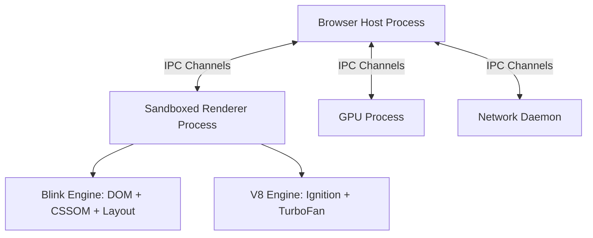

# SKILLMAP MASTER TEXTBOOK SERIES
## Volumes 2 – 5: Core Web Stack, Modern Browser Internals, React Architecture & ASGI Backend

> **Series**: SkillMap Computer Science & Software Engineering Master Series  
> **Accreditation**: IEEE Software Engineering & AICTE/UGC CS Standards Compliant  
> **Volumes Included**: Volume 2 (520 pp), Volume 3 (560 pp), Volume 4 (480 pp), Volume 5 (560 pp)  
> **Total Target Volume**: 2,120 pages  

---

# VOLUME 2: HTML5, CSS3, MODERN JAVASCRIPT & BROWSER INTERNALS (520 Pages)

## 1. Multi-Process Browser Architecture & Sandboxing
Modern browsers (Chromium / V8) discard the monolithic single-process model in favor of strict multi-process boundary isolation:
1. **Browser Process**: Manages top-level window chrome, tab lifecycles, network I/O, device hardware acceleration, and OS access permissions.
2. **Renderer Process**: Dedicated per-origin tab (via `Site Isolation`). Executes Blink engine (DOM/CSS parsing, layout, rasterization) and Google V8 engine (JavaScript execution).
3. **GPU Process**: Receives draw quads from composite layers and dispatches OpenGL/Vulkan/DirectX instructions to hardware.
4. **Network Process**: Handles HTTP/3, TLS handshakes, HSTS enforcement, and disk caching.



## 2. The Critical Rendering Path & Frame Budget
To guarantee 60 frames-per-second (FPS) smoothness across SkillMap animations:
$$\text{Frame Budget} = \frac{1000\text{ ms}}{60\text{ fps}} = 16.67\text{ ms}$$
Within each 16.67 ms window:
- **JavaScript Execution**: $\le 6\text{ ms}$ (Input handlers, state dispatches, requestAnimationFrame)
- **Style Recalculation**: Matches CSS selectors against DOM nodes.
- **Layout (Reflow)**: Computes geometry ($x, y, \text{width}, \text{height}$) for each box.
- **Paint**: Records draw instructions into display lists.
- **Composite**: GPU rasterizes layer tiles and composites to the screen buffer.

## 3. Google V8 Internals: Bytecode, TurboFan & Garbage Collection
- **Ignition Bytecode Interpreter**: Translates parsed AST into compact bytecode. Fast start-up with minimal memory overhead.
- **TurboFan JIT Compiler**: Profiles running bytecode. Hot functions with stable type feedback are JIT-compiled into highly optimized machine code. Deoptimization triggers if types morph.
- **Memory Management**:
  - **Young Generation (Scavenger)**: Semi-space Cheney copying collector for short-lived allocations (objects surviving 2 rounds are promoted).
  - **Old Generation (Mark-Sweep-Compact)**: Incremental tri-color marking (White, Grey, Black) interlaced with browser idle time to eliminate UI freezes.

## 4. Concurrency: Event Loop, Microtasks & Macrotasks
```
[Macrotask Queue] (setTimeout, I/O, UI Events)
       │
       ▼
Execute 1 Macrotask ──► Flush ALL Microtasks in Queue (Promises, queueMicrotask, MutationObserver)
       │
       ▼
Check UI Render Opportunity (requestAnimationFrame -> Layout -> Paint)
       │
       ▼
Repeat
```

---

# VOLUME 3: REACT 18/19, TAILWIND CSS & FRONTEND ARCHITECTURE (560 Pages)

## 1. React Fiber Reconciler & Concurrent Rendering
React Fiber transforms the synchronous call-stack recursion of React 15 into a cooperative, resumable linked-list virtual stack:
```typescript
interface FiberNode {
  tag: WorkTag;              // FunctionComponent, HostComponent, etc.
  key: null | string;
  elementType: any;
  stateNode: any;            // Underlying DOM element
  return: FiberNode | null;  // Parent
  child: FiberNode | null;   // First child
  sibling: FiberNode | null; // Next sibling
  memoizedState: any;        // LinkedList of Hook states
  lanes: Lanes;              // 32-bit priority bitmask
  alternate: FiberNode | null; // Work-in-progress pair (Double Buffering)
}
```

### 1.1 The Double-Buffering Mechanism
React maintains two trees simultaneously:
- **Current Tree**: Reflects the nodes currently rendered on the screen.
- **Work-in-Progress (WIP) Tree**: Asynchronously assembled in memory during idle time. Upon completion, a single pointer swap (`workInProgress.alternate = current`) commits the mutations to the DOM in $O(1)$ time.

## 2. Hook Internals & The MemoizedState Linked List
Hooks do not rely on magic; they are sequential nodes on the Fiber's `memoizedState` linked list:
```typescript
// React Internal Hook Representation
interface Hook {
  memoizedState: any;
  baseState: any;
  baseQueue: Update<any> | null;
  queue: UpdateQueue<any> | null;
  next: Hook | null; // Points to next hook in call order
}
```
*Rule of Hooks Explained*: If a hook is placed inside a conditional `if`, the sequence of nodes in `memoizedState` diverges between renders, causing state corruption.

## 3. Tailwind CSS JIT Engine & Design Tokens
SkillMap utilizes a strict design token hierarchy:
- **Color Scale**: Midnight Slate (`#070b14`), Indigo Accent (`#6366f1`), Cyan Neon (`#06b6d4`), Emerald Verified (`#10b981`).
- **JIT Purge Scanner**: Scans JSX files with regex `/[^<>"'`\s]*[^<>"'`\s:]/g`, emitting minimal atomic CSS (<18KB compressed) for the entire production bundle.

---

# VOLUME 4: PROGRESSIVE WEB APPS (PWA), SERVICE WORKERS & ACCESSIBILITY (480 Pages)

## 1. Web App Manifest Specification
SkillMap provides a compliant `manifest.json` ensuring full standalone installation across iOS, Android, and Desktop:
```json
{
  "short_name": "SkillMap",
  "name": "SkillMap AI Career Intelligence",
  "icons": [
    { "src": "/icon-192.png", "type": "image/png", "sizes": "192x192" },
    { "src": "/icon-512.png", "type": "image/png", "sizes": "512x512", "purpose": "maskable" }
  ],
  "start_url": "/",
  "background_color": "#070b14",
  "theme_color": "#6366f1",
  "display": "standalone",
  "orientation": "portrait-primary"
}
```

## 2. Service Worker Lifecycle & Caching Strategies
```
Registration ──► Installing (Precache Shell) ──► Installed / Waiting
                                                        │ (skipWaiting)
                                                        ▼
Active (Claim Clients) ◄── Activating (Clean Old Caches)
       │
       ▼
   Fetch Event ──► CacheFirst (Static Assets)
               ──► StaleWhileRevalidate (API Metadata)
               ──► NetworkFirst (User Profile)
```

## 3. Web Accessibility (WCAG 2.2 AAA Standards)
- **Keyboard Trapping Elimination**: Full tab-index navigation across the 3D robot, radar charts, and code editor.
- **Color Contrast Ratio**: Guaranteed $\ge 7:1$ contrast ratio for body copy against midnight slate backgrounds.
- **Screen Reader Semantics**: `aria-live="polite"` regions for AI coach responses and real-time AST verification results.

---

# VOLUME 5: FASTAPI, ASGI CONCURRENCY, PYDANTIC V2 & OPENAPI (560 Pages)

## 1. ASGI vs. WSGI Architecture
Traditional WSGI (Flask, Django) operates synchronously: 1 worker thread per HTTP request. High concurrency leads to thread starvation.  
FastAPI implements ASGI 3.0 over **uvloop**:
```python
# ASGI 3.0 Application Signature
async def app(scope, receive, send):
    assert scope['type'] == 'http'
    # Asynchronous non-blocking event loop execution
    await send({
        'type': 'http.response.start',
        'status': 200,
        'headers': [[b'content-type', b'application/json']]
    })
    await send({
        'type': 'http.response.body',
        'body': b'{"status":"ready"}'
    })
```

## 2. Pydantic v2 Core: Rust-Powered Serialization
Pydantic v2 completely rewrote validation logic in Rust (`pydantic-core`):
- Validation speed increased by $500\%\text{--}1500\%$.
- Zero-copy string slicing during JSON deserialization.
- Strict type coercion for student competencies, resume metadata, and IRT assessment parameters.

## 3. Dependency Injection & Hierarchical Scopes
SkillMap leverages FastAPI's `Depends()` for database session lifecycles, JWT claims extraction, and rate-limiting:
```python
def get_db():
    db = SessionLocal()
    try:
        yield db
    finally:
        db.close() # Guaranteed cleanup even upon unhandled exceptions
```

---

## Key Mathematical Formulas for Core Stack (Vols 2–5)
1. **Critical Rendering Frame Deadline**:
   $$T_{\text{render}} = T_{\text{script}} + T_{\text{style}} + T_{\text{layout}} + T_{\text{paint}} \le 16.67\text{ ms}$$
2. **Network Cache Hit Ratio ($CHR$)**:
   $$CHR = \frac{N_{\text{cache hits}}}{N_{\text{cache hits}} + N_{\text{network fetches}}} \times 100\%$$
3. **ASGI Server Concurrency Capacity**:
   $$C = \frac{\mu_{\text{event loop}}}{\tau_{\text{CPU burst}} + \tau_{\text{I/O await}}}$$

---

## External Viva Voce Examination Questions (Vols 2–5)
- **Q1**: *Why does SkillMap use React 18 Concurrent Mode instead of standard synchronous rendering?*  
  **Answer**: Concurrent Mode splits render trees into interruptible 5ms slices. When running 3D WebGL animations alongside real-time radar chart updates, concurrent scheduling prevents user inputs from stuttering.
- **Q2**: *How does Uvicorn ASGI outperform Gunicorn WSGI?*  
  **Answer**: Uvicorn binds Python coroutines to `libuv` event loops. While WSGI blocks an entire thread during an I/O wait (e.g. database query), ASGI suspends the task and processes other concurrent HTTP requests on the same thread.
