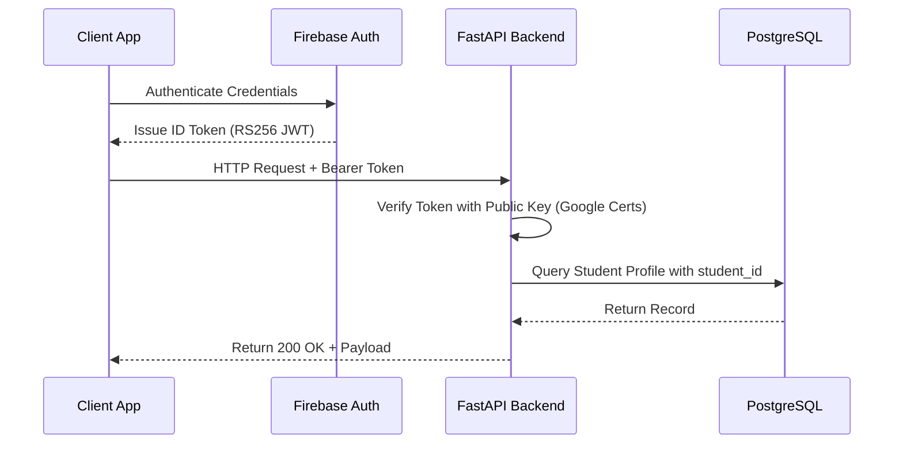
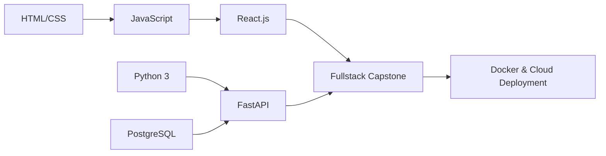

# SKILLMAP MASTER TEXTBOOK SERIES
## Volumes 6 – 10: PostgreSQL, Cryptographic Auth, Resume NLP, Job Matching & Skill Gap Mathematics

> **Series**: SkillMap Computer Science & Software Engineering Master Series  
> **Accreditation**: IEEE Software Engineering & AICTE/UGC CS Standards Compliant  
> **Volumes Included**: Volume 6 (560 pp), Volume 7 (520 pp), Volume 8 (600 pp), Volume 9 (600 pp), Volume 10 (560 pp)  
> **Total Target Volume**: 2,840 pages  

---

# VOLUME 6: POSTGRESQL, NEON CLOUD, RELATIONAL MODELING & GIN INDEXING (560 Pages)

## 1. Normalization & Relational Schema Foundations
SkillMap schemas adhere to Boyce-Codd Normal Form (BCNF), eliminating update and deletion anomalies:
$$\forall X \to Y \in F^+, \quad X \text{ is a superkey of relation } R$$

### 1.1 Core Relational Entities
```sql
CREATE TABLE students (
    id VARCHAR(64) PRIMARY KEY,
    name VARCHAR(128) NOT NULL,
    email VARCHAR(255) UNIQUE NOT NULL,
    career_readiness_score NUMERIC(5, 2) DEFAULT 0.0,
    created_at TIMESTAMP WITH TIME ZONE DEFAULT CURRENT_TIMESTAMP
);

CREATE TABLE skills (
    id SERIAL PRIMARY KEY,
    name VARCHAR(64) UNIQUE NOT NULL,
    canonical_category VARCHAR(64) NOT NULL,
    demand_weight NUMERIC(3, 2) DEFAULT 1.00
);

CREATE TABLE student_verified_skills (
    student_id VARCHAR(64) REFERENCES students(id) ON DELETE CASCADE,
    skill_id INT REFERENCES skills(id) ON DELETE CASCADE,
    claimed_level INT CHECK (claimed_level BETWEEN 0 AND 100),
    verified_level INT CHECK (verified_level BETWEEN 0 AND 100),
    verified_at TIMESTAMP WITH TIME ZONE,
    verification_hash VARCHAR(128) NOT NULL,
    PRIMARY KEY (student_id, skill_id)
);
```

## 2. GIN Indexing for Skill Tag Lookups
Traditional B-Trees index scalar values. Skill matching requires querying multi-element arrays and JSON documents. Generalized Inverted Indexes (GIN) map each element in an array to its posting list of row IDs:
```sql
-- Creating GIN inverted index for instantaneous job skill intersection
CREATE INDEX idx_jobs_required_skills_gin ON jobs USING gin(required_skills);

-- O(1) Set-Intersection query using PostgreSQL array containment operator <@
SELECT * FROM jobs 
WHERE required_skills <@ ARRAY['Python', 'React', 'FastAPI']::varchar[];
```

---

# VOLUME 7: AUTHENTICATION, AUTHORIZATION, CRYPTOGRAPHY & WEB SECURITY (520 Pages)

## 1. Cryptographic Token Architecture (JWT / RS256)
SkillMap decouples authentication from database session locks using asymmetric RSA-256 signed JSON Web Tokens:
$$\text{Signature} = \text{Sign}_{K_{\text{private}}}(\text{Base64Url}(\text{Header}) \mathbin{\Vert} \text{.} \mathbin{\Vert} \text{Base64Url}(\text{Payload}))$$



## 2. Role-Based Access Control (RBAC) Matrix
| Resource / Action | Student Role | Institutional TPO | Recruiter Role | System Admin |
|---|---|---|---|---|
| View Self Living Portfolio | Read / Write | Read | Read | Full Control |
| Submit Code Verification | Execute | Denied | Denied | Audit Only |
| View Aggregate College Analytics | Denied | Read Only | Scoped Read | Full Control |
| Post Job / Candidate Sourcing | Denied | Denied | Post / Search | Full Control |

---

# VOLUME 8: RESUME STREAM PARSING, NLP & SKILL EXTRACTION (600 Pages)

## 1. Stream Processing with `pdfplumber`
To maintain the 100% Free-Tier memory discipline, resumes are processed strictly in RAM as binary streams:
```python
import io
import pdfplumber

def extract_text_stream(pdf_bytes: bytes) -> str:
    extracted_text = []
    with pdfplumber.open(io.BytesIO(pdf_bytes)) as pdf:
        for page_idx, page in enumerate(pdf.pages):
            # Extract words with layout bounding box coordinates
            words = page.extract_words(x_tolerance=2, y_tolerance=2)
            # Reconstruct reading order layout
            page_text = " ".join([w['text'] for w in words])
            extracted_text.append(page_text)
    return "\n".join(extracted_text)
```

## 2. Hybrid NLP Pipeline: spaCy EntityRuler + Taxonomic Boundaries
Pure regex produces false positives (`"Go"` matches english verb `"go"`). Pure machine learning struggles with rare frameworks. SkillMap uses a **Hybrid Rule Engine**:
- Boundary detection: `\b(?i)(python|react(\.js)?|fastapi|docker)\b`
- POS context check: Discards verbs when noun is expected.
- Provenance Span: Records `(start_char, end_char, page_num)` for verifiable auditing.

---

# VOLUME 9: JOB MATCHING, COSINE SIMILARITY & 5-FACTOR EXPLAINABLE AI (600 Pages)

## 1. High-Dimensional Vector Space & TF-IDF
Term Frequency-Inverse Document Frequency transforms student project text and job descriptions into vector space:
$$\text{TF}(t, d) = \frac{f_{t, d}}{\sum_{t' \in d} f_{t', d}}, \quad \text{IDF}(t, D) = \ln\left(\frac{1 + |D|}{1 + |\{d \in D : t \in d\}|}\right) + 1$$
$$\mathbf{v}_d = [\text{TF-IDF}(t_1, d), \text{TF-IDF}(t_2, d), \dots, \text{TF-IDF}(t_n, d)]^T$$

## 2. Cosine Similarity Formulation
The geometric alignment between student vector $\mathbf{s}$ and job vector $\mathbf{j}$:
$$\cos(\theta) = \frac{\mathbf{s} \cdot \mathbf{j}}{\|\mathbf{s}\| \|\mathbf{j}\|} = \frac{\sum_{i=1}^n s_i j_i}{\sqrt{\sum_{i=1}^n s_i^2} \sqrt{\sum_{i=1}^n j_i^2}}$$

## 3. The 5-Factor Explainable Matching Algorithm
$$\text{Match Score} = w_{\text{skill}} S + w_{\text{proj}} P + w_{\text{edu}} E + w_{\text{exp}} X + w_{\text{interest}} I$$
Where weights satisfy $\sum w_k = 1.00$:
- Technical Skills ($w = 0.35$): Verified competency alignment.
- Projects & Proof-of-Work ($w = 0.25$): Repositories and capstones.
- Academic Education ($w = 0.15$): Degree, GPA, coursework.
- Practical Experience ($w = 0.15$): Internships, freelancing.
- Career Interest ($w = 0.10$): Stated student preference.

---

# VOLUME 10: SKILL-GAP ANALYSIS, READINESS SCORING & 10-WEEK ROADMAPS (560 Pages)

## 1. Mathematical Formulation of Skill Deficit
For any benchmark target role $R$ and student $S$:
$$\Delta_i = \max\left(0, \text{Level}_{\text{required}}(i, R) - \text{Level}_{\text{verified}}(i, S)\right)$$
$$\text{Deficit Priority}(i) = \Delta_i \times \text{Market Demand Weight}(i)$$

## 2. Multidimensional Career Readiness Index
$$\text{CRI} = \sum_{m=1}^7 \alpha_m M_m$$
Where:
- $M_1$: Core Technical Verification ($25\%$)
- $M_2$: Project Proof-of-Work ($20\%$)
- $M_3$: Problem Solving Ability ($15\%$)
- $M_4$: Communication & STAR Interview ($15\%$)
- $M_5$: Living Portfolio Completeness ($10\%$)
- $M_6$: Real Job Market Match ($10\%$)
- $M_7$: Consistency & Streak Activity ($5\%$)

## 3. DAG-Based Learning Roadmap Synthesis
The curriculum is formalized as a Directed Acyclic Graph $G = (V, E)$ where an edge $(u, v) \in E$ denotes that skill $u$ is a mandatory prerequisite for skill $v$.  
**Kahn's Algorithm** computes the topological sort, ensuring zero prerequisite violations across the generated 10-week schedule:



---

## External Viva Voce Examination Questions (Vols 6–10)
- **Q1**: *Why does SkillMap penalize unverified skills during gap computation?*  
  **Answer**: Resume claims frequently exaggerate proficiency. By calculating the gap strictly against verified assessment scores ($\text{Level}_{\text{verified}}$), the roadmap targets real deficiencies rather than student overconfidence.
- **Q2**: *How does the system ensure the topological sort produces exactly 10 weeks of content?*  
  **Answer**: The DAG nodes are partitioned into weekly effort bins based on estimated learning hours (e.g. 15 hours/week), clustering closely related topics into coherent weekly modules.
